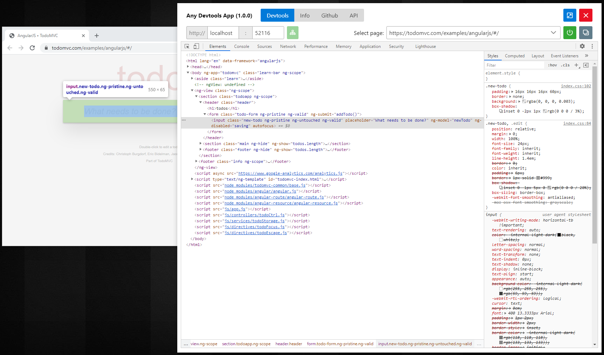

# Devtools App (Angular)

A wrapper for Chrome Devtools.

## How to use?

- Launch Chrome with the following flag

```
> "C:\Program Files (x86)\Google\Chrome\Application\chrome.exe" --remote-debugging-port=9222 --no-first-run --no-default-browser-check
```

- Launch the Devtools App
- Click on green ```play``` button. This will populate the candidate pages to debug.
- Select a page to debug and you will see a hosted Devtools debugging the page you selected.

**NOTE: After starting devtools make sure to Enable Javascript Source Maps in Settings**

- There is support for launching the Chrome browser in remote debugging mode on specified URL.

## Screenshot



## Nodejs debugging

You can also debug node application by starting node like so:

```
> node --inspect ...
Debugger listening on ws://127.0.0.1:9229/280a4f91-9735-416d-b689-0b86fcbabe3c
For help, see: https://nodejs.org/en/docs/inspector
```

and then changing the port to 9229 in Devtools App and following the same process.
